# Vision Desk

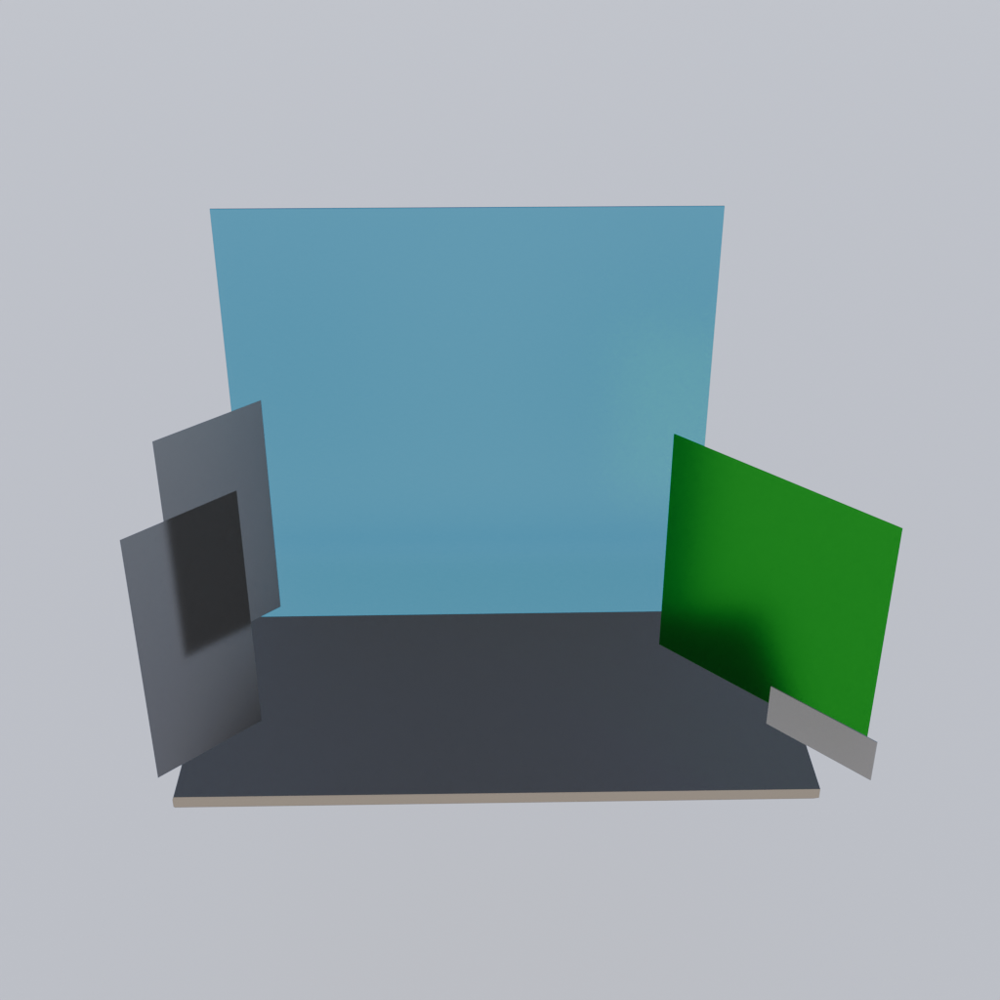

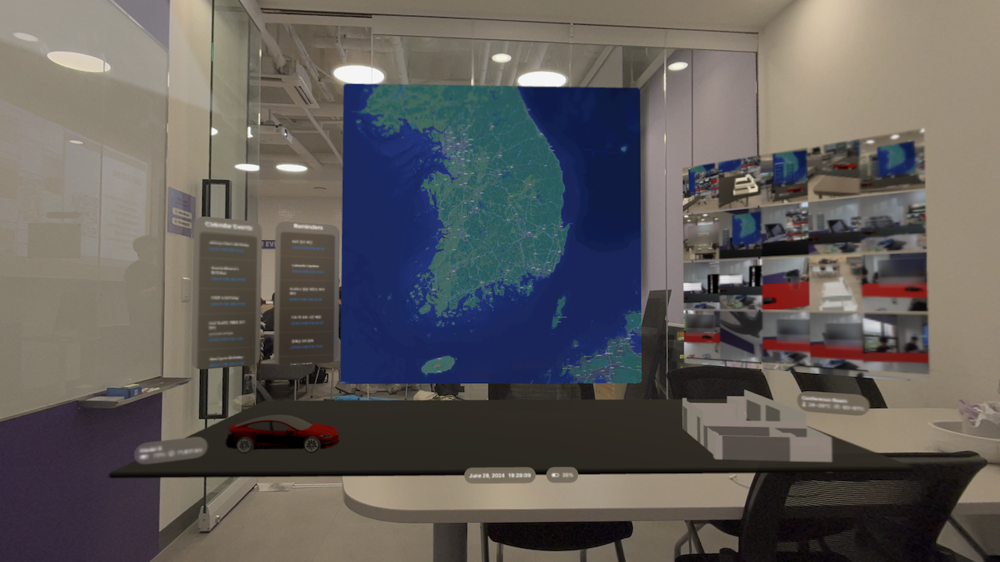

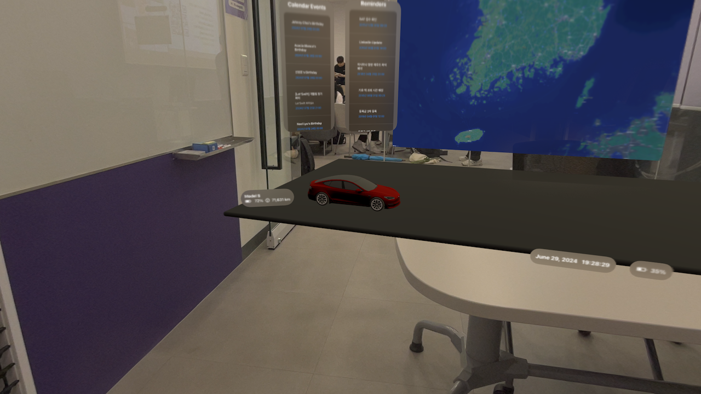

Vision Pro를 통해 가상 공간에서 책상 위 작업대를 재현하여 효율적이고 직관적인 작업 환경을 제공합니다, 다양한 도구와 자료를 손쉽게 배치하여 최고의 생산성을 어디서든 경험하세요!

 [let us: Hack! 2024](https://letusgo2024-summer.vercel.app)

6팀 - 구범모, 서재훈, 심재빈, 조영진 (범모, Akaps, JBJB, 소공)

🏅 __대상__ 🥇

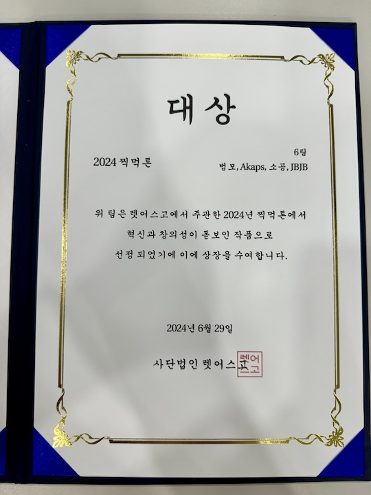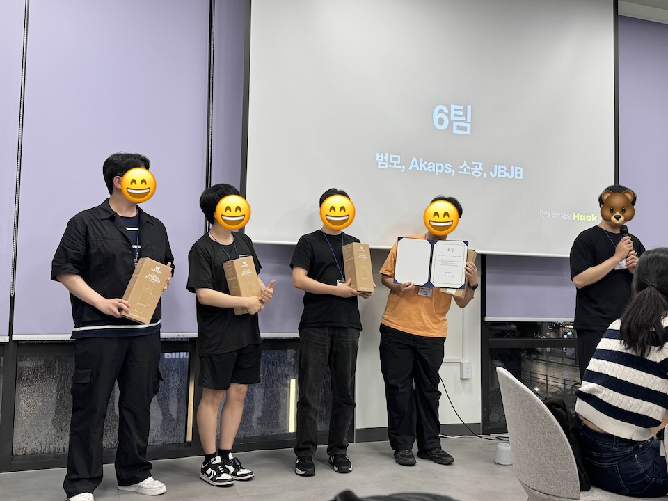

## Tech Stack

- visionOS
- RealityKit, ARKit, plane detection (horizontal, table)
- RoomPlan [Sample app](https://developer.apple.com/documentation/roomplan/create_a_3d_model_of_an_interior_room_by_guiding_the_user_through_an_ar_experience)
- Reality Composer Pro, Reality Converter, Blender
- EventKit, PhotoKit, MapKit

## 중간 과정

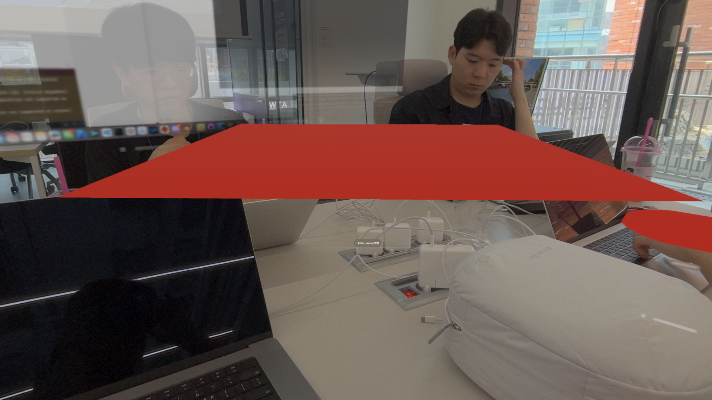
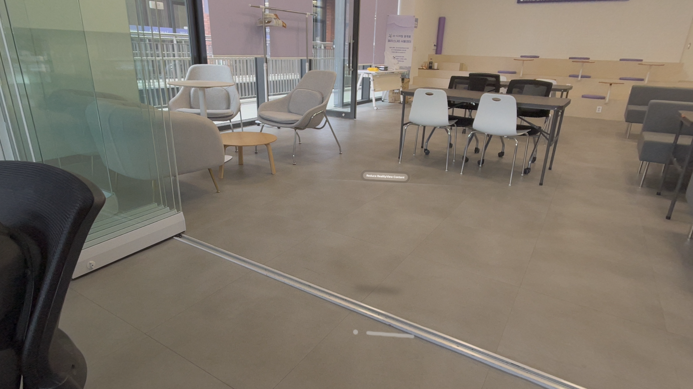
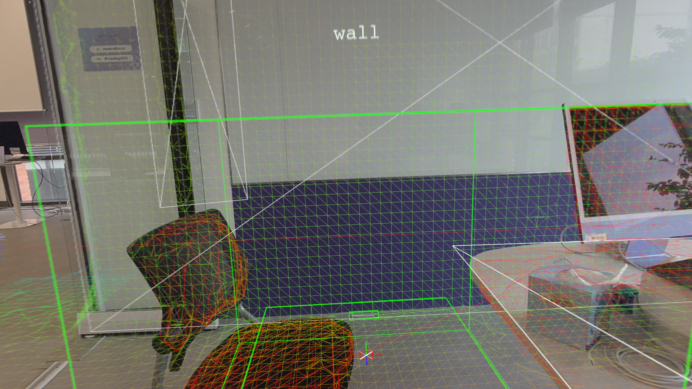
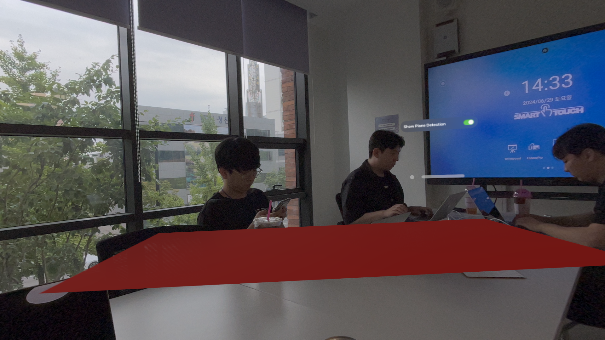
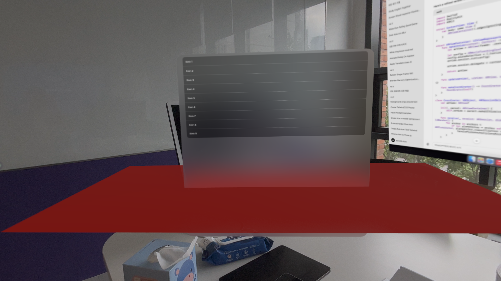
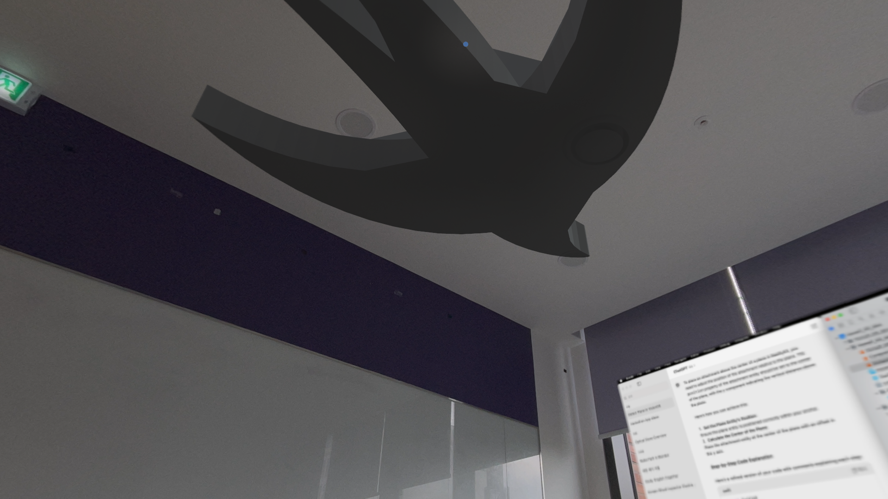

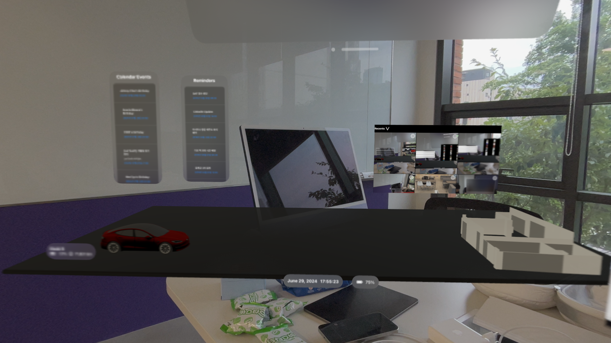
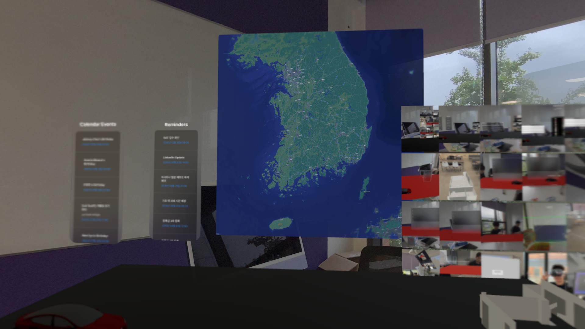
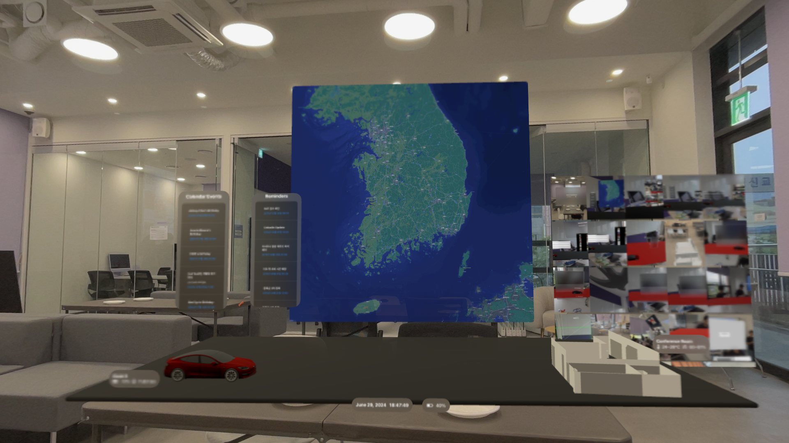

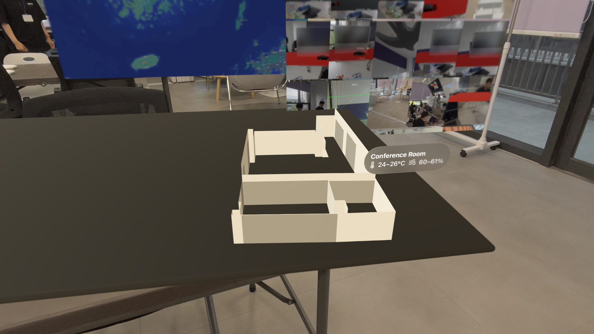
